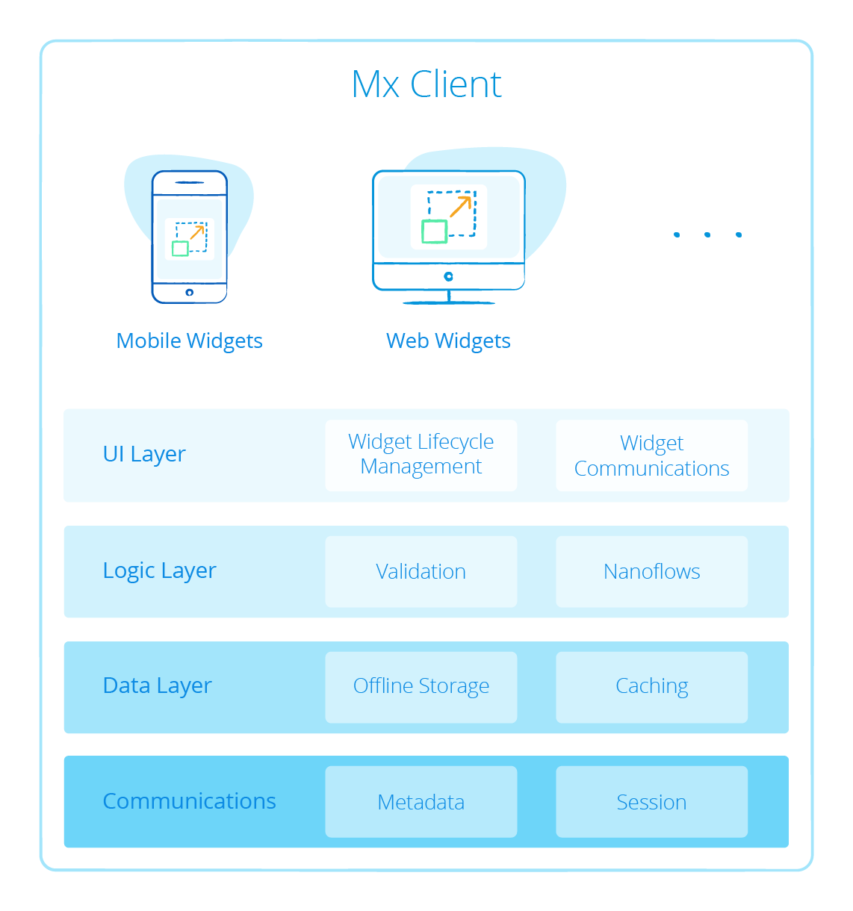

## 1 Introduction

The Mendix Runtime executes the application model that is created in Studio Pro. It serves pages to the Mendix Client, executes microflows, calls web services, generates documents, communicates with the database, and much more.

### 2.2 Client Architecture

The Mendix Client is responsible for the user interaction and consists of a UI widget layer, a logic layer to execute offline logic, and a data layer for offline storage. This diagram presents an overview:

{}

{}

The Mendix Client consists of the following components:

* **Communications layer** – exchanges metadata, session managements, and data with the Mendix Runtime server while using a secure JSON over HTTP protocol
* **Data layer** – manages the data used in the front-end; based on the React Flux pattern to handle state and push changes to UI components
* **Logic layer** – handles data validations and more complex logic using Mendix nanoflows
* **UI component layer** – manages the widget lifecycle and communication between widgets, and provides out-of-the-box widgets

#### 2.2.1 Mobile Client

Mobile applications use the same HTML5-, CSS-, and React-based client architecture, but they are deployed using Apache Cordova. This framework enables mobile apps built using state-of-the-art web technologies to offer a great mobile user experience:

* **Accessibility** – apps can be discovered in the standard device app store, installed on mobile devices, and opened via an icon
* **Offline availability** – because the app is installed on mobile devices (including all required resources and potentially cached data), end-users can use your Mendix app offline, and relevant app data is cached in an SQLite database on your device
* **Support for native functionality** – Apache Cordova enables JavaScript applications to use native device functionality, which in turn allows you to benefit from all the sensors available in your mobile device, like the camera and microphone, for example

For more details on Mendix mobile device support, see [Native Mobile Apps](../app-capabilities/native-mobile-apps) and [Hybrid Mobile Apps](../app-capabilities/hybrid-mobile-apps).

#### 2.2.2 Web Client

The web client is designed using a single-page architecture, wherein a single JavaScript web page is loaded into the browser that will then update the page and interact with the Mendix Runtime as required by the actions of the user. This may include retrieving parts of the web page as well as retrieving and storing data.

The client is predominantly implemented using HTML5, CSS with Sass and Bootstrap, and the React framework. For more information, see [Web Client Settings](https://docs.mendix.com/refguide/custom-settings#9-web-client-settings) in the *Mendix Studio Pro Guide*.
