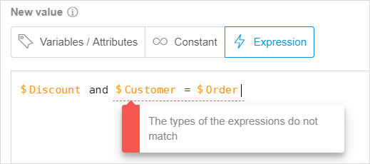
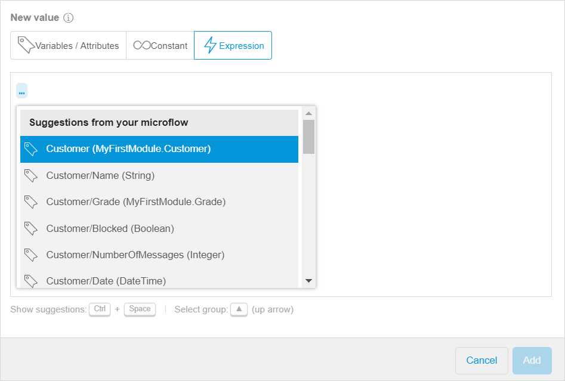
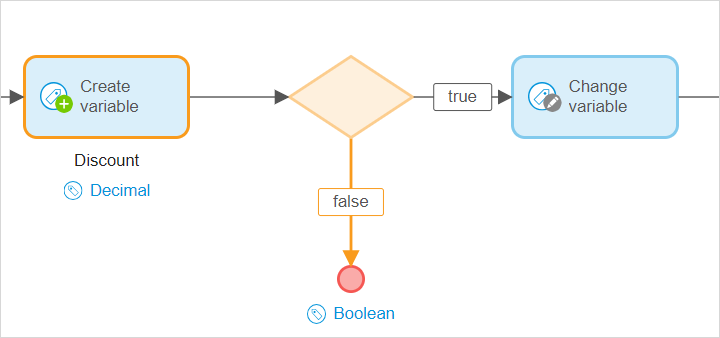
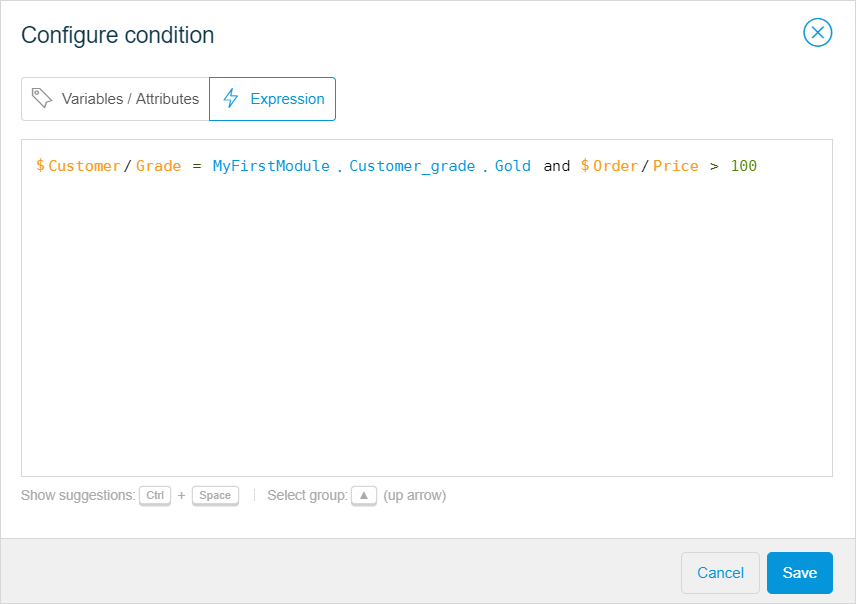
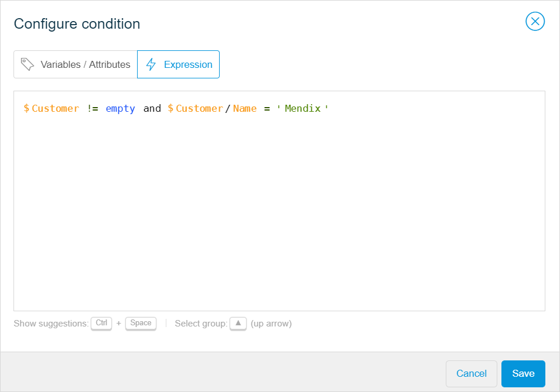

## 1 Introduction 

Expressions can be used to create or change an object or a variable based on logic. 

The **Expression** tab is opened when you configure the following activities in the microflow:

*  [End Event](/refguide/end-event)
*  [Exclusive Split](microflows-exclusive-split)
*  [Create Object](/refguide/create-object)
*  [Change Object](/refguide/change-object)
*  [Create Variable](/refguide/create-variable) 
*  [Change Variable](/refguide/change-variable)

For more information, see [Setting and Changing a Value for Different Activities in the Microflows in the Web Modeler](microflows-setting-and-changing-value).

## 2 Writing the Expression

There are two ways of writing an expression:

* Using suggestions
* Writing the expression manually

If some errors appear in the expression, hints with an explanation will be displayed. 

{}
{}

### 2.1 Writing the Expression Using Suggestions

When you start typing the expression, a list of suggestions appears divided into the following categories:

* **Suggestions from your microflow** – variables or attributes that you have created or retrieved in your microflow
* **Enumeration values** – values of [enumeration type of attributes](domain-models-enumeration) that can be used in an expression
* **Keywords** – key phrases or words that you can use in an expression
* **Booleans** – true or false expressions
* **Operators** – code elements that perform logical or mathematical operations. You can use Boolean or relational expressions (for more information, see section [3 Expression Types](#expression-types))

To write an expression using suggestions, do the following:

1. Browse through the list of suggestions and select the element for your expression with a mouse or a keyboard.
2. To add more elements to the expression, press <kbd>Space</kbd>.
3. Select the element from the list.
4. Click **Add** when the expression is completed.

{}

To call the list of suggestions, press <kbd>Ctrl</kbd> + <kbd>Space</kbd>

{}

### 2.2 Writing the Expression Manually

If you want to write the expression manually, pay attention to the following:

* Variables in the microflow can be called in an expression by inserting the dollar sign followed by the name of the variable. For example, *$Customer* refers to the variable *Customer*  
* Attributes and associations of object variables are accessed using a slash, for example, *$Customer/Name*, *$Customer/Grade* refer to the attributes Name and Grade of the entity Customer 
* Unary, Boolean, and relational types of expressions are available in the Web Modeler (for more information, see section [3 Expression Types](#expression-types))

### 2.3 Examples of the Expression

Let us study two examples that illustrate how the expression can be used. 

#### 2.3.1 Example 1

You have an exclusive split and you want to write an expression that checks whether the customer grade is gold and the price of the order is more than 100 (you can configure a discount after the split that is allowed if this expression is true). 

 

The expression will look the following way:

#### 2.3.2 Example 2

A common example is when you first check if the object (in our example the object is *Customer*) exists. And then you check if the Customer's name matches a particular one (in our example Customer's name is *Mendix*). The expression will look the following way:

## 3 Expression Types {#expression-types}

An overview of the possibilities with expressions can be found below:

### 3.1 Relational Expressions

* [Less than ( < )](/refguide/relational-expressions)
* [Greater than ( > )](/refguide/relational-expressions)
* [Less than or equal to ( <= )](/refguide/relational-expressions)
* [Greater than or equal to ( >= )](/refguide/relational-expressions)
* [Is equal to ( = )](/refguide/relational-expressions)
* [Is not equal to ( != )](/refguide/relational-expressions)

### 3.2 Boolean Expressions

* [and](/refguide/boolean-expressions)
* [or](/refguide/boolean-expressions)

## 4 Read More

* [Microflows in the Web Modeler](microflows)
* [Setting and Changing a Value for Different Activities in the Microflows in the Web Modeler](microflows-setting-and-changing-value)
